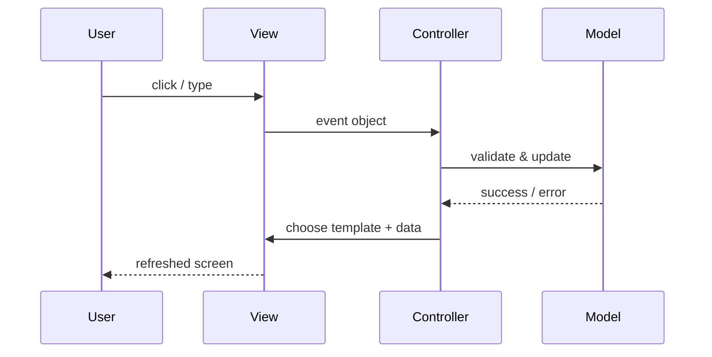

## Exercise 1


--- 

## Exercise 2

### 1. **What is your understanding of the term “Design Patterns”?**  
   In everyday programming we keep running into the same architectural headaches—how to create objects, let them talk to each other, keep them interchangeable, … Over the years practitioners have documented these recurring solutions and given them names. Those “design patterns” are language-independent blueprints that capture the intent of a technique, its forces and trade-offs that speed up team communication. They are not copy-and-paste code, though; they are recipes in a sense. 

### 2. **Explain the MVC Pattern**  
| Layer | What it is | Examples |
|-------|--------------------|----------------------------------|
| **Model** | Abstraction for entities and attributes. | `SampleBatch`, `SensorReading`, SQLAlchemy entities |
| **View** | The layer that the user interacts with	 | Jinja2 HTML dashboard, PyQt charts, JSON payload from `/api/v1/readings` |
| **Controller** | Under the view: listens for outside events, tells the Model what changed, then decides which View to hand back. | Flask route `POST /runs`, FastAPI endpoint, PyQt slot wired to a “Start run” button |

Flow:



Use cases:
- Interactive lab dashboards 
- CRUD back-office tools where the UI shouldn’t interfere the data logic. 

### 3. **List three other design patterns**  
   - Provide names and details for three additional design patterns.
   - Explain how you have used those patterns in the past and how they have solved your problem  
   - Use diagrams to explain the design patterns.

   A. Factory Method 

   ```mermaid
   classDiagram
    class ExperimentFactory {
        + createRun(type): Run
    }
    class CalibrationRun
    class StressRun
    ExperimentFactory <|.. CalibrationRun
    ExperimentFactory <|.. StressRun
   ```

   I built a tiny desktop tool that injects home-brew “quality-of-life” hacks into classic Game Boy ROMs—color palettes, bug fixes, new title screens. Each game family needs its own patching routine because the file headers and checksum rules differ wildly. My task was to keep the UI to a single “Patch ROM” button instead of a nest of game-specific menus, while letting me add new consoles later. I dropped every concrete routine into a `Patcher` subclass and registered it with a `PatcherFactory.make(console_id)`. The factory picks the right class at runtime, so the GUI never knows which algorithm is being used. When I decided to support the Sega Game Gear halfway through the semester, I wrote one `GearPatcher` file, and the existing interface magically handled it—no UI edits, no regressions, still passes the checksum test suite.

   B. Observer 

   ```mermaid
   classDiagram
    class Subject {
        + attach(Observer)
        + detach(Observer)
        + notify()
    }
    class Observer {
        + update()
    }
    Subject o-- "n" Observer
   ```

   My flat’s south-facing window fries my mom's plants unless moisture, light, and ambient temperature are balanced. I wired a Pi to three cheap I²C sensors and a peristaltic pump, but each sensor reports at its own cadence (light changes faster than soil). My task was to update the OLED dashboard and decide watering bursts in real time—without hard-coupling everything to one master loop. I wrote a minimalist `EventBus` subject in Rust; every sensor pushes a `Reading` event, while the pump controller and UI subscribe via `on_change`. Components can appear or disappear (I sometimes unplug the temp probe) with zero code tweaks. *Result*: My mom's plants lived through a two-week holiday; swapping a faulty light sensor took thirty seconds and the rest of the system never missed a beat.

   C. Strategy
   
   ```mermaid
   classDiagram
    class PumpController {
        - strategy: PumpStrategy
        + setStrategy(ps: PumpStrategy)
        + execute()
    }

    class PumpStrategy {
        <<interface>>
        + run(volume)
    }

    class PIDStrategy
    class BangBangStrategy

    PumpController --> PumpStrategy
    PumpStrategy <|.. PIDStrategy
    PumpStrategy <|.. BangBangStrategy
   ```

   I’m currently coding a tiny Minecraft-style roguelike, and I need to experiment with multiple terrain algorithms—diamond-square, Perlin noise, and a cellular-automata cave maker—switchable while the game is running. My task is to allow hot-swapping of generation algorithms from the debug console so I can A/B test performance and aesthetic feel. I defined a TerrainStrategy trait with generate(chunk_seed) -> Mesh; concrete strategies live in separate modules. The world builder keeps a mutable strategy reference, and a single console command calls set_strategy("perlin"). During the demo I could fade between rolling hills and labyrinthine caves in real time; profiling showed Perlin was 12 % slower, so I optimised only that module with no need to touch the rest of the engine.

--- 

## Exercise 3 
### 1. **Implementation Task**  
   ```mermaid
   classDiagram

   class A {
      # Name : string
      + PrintName() void
   }

   <<abstract>> A

   class B {
      - PrintName(message : string) void
   }

   class C {
      + PrintName(message : string) void
   }

   D --|> A
   B --|> A
   C --|> B
   ```


### 2. **Key Questions**  
   - Are you able to directly create a new instance of `ObjectA`? Please explain your answer.  

   No. `A` is marked abstract; it contains at least one abstract method (`print_name`). Attempting `A("x")` raises TypeError in Python.

   - Given an instance of `ObjectC`, are you able to call the method `PrintMessage` defined in `ObjectB`? Please explain your answer.  

   The original `B.__print_name` is private to B, so it isn’t inherited in an accessible way. 

   - Try to explain as many key features of object-oriented programming as you can find in this example.
   
      - Abstraction* (A sets a contract).
      - Inheritance* (B, C, D reuse A).
      - Encapsulation* (access modifiers hide internals).
      - Polymorphism* (print_name resolved at runtime).
      - Method overriding* (C provides its own version).
      - Access control* (private vs protected).

---

## Exercise 4

### Maintaining and Expanding Software for Component Validation

### 1. **Working with Existing Code**  
- How would you approach understanding and contributing to an existing code base with minimal disruption?  
- What practices would you follow to ensure your changes integrate well with the current structure?  

First, I’d make sure I can build and run the project on my machine and watch the tests go green. That gives me a feel for how everything fits together. Next, I’d read the README, any architecture notes, and then skim the folder structure to see where things live. When I need to change something, I start a fresh branch and keep the edits small—usually one feature or bug fix per pull request—so reviewers can follow my thinking. I stick to the project’s style guide and naming rules to avoid adding “code accent” that looks out of place.

### 2. **Ensuring Maintainability**  
- What techniques would you use to keep the code base clean, modular, and easy to maintain as new features are added?  
- How would you handle code documentation and testing to support long-term maintainability?  

I try to group related functions or classes into clear modules and avoid long files that do a bit of everything. Before pushing, a formatter and linter run automatically, so messy whitespace or obvious mistakes never land in main. For docs, I write short comments only where the code isn’t self-explanatory and add a quick note whenever we make a design decision that others should know about. Every new piece of logic comes with unit tests, and if it talks to a database or API I’ll add an integration test too. This way, future contributors can refactor with confidence.

### 3. **Balancing Flexibility and Stability**  
- How would you design or refactor the software to make it flexible for future changes while ensuring the existing functionality remains stable?  
- Which design patterns or principles would you apply to achieve this balance

When I add new features, I look for spots where the code is tightly coupled—like one class directly creating another—and add an interface or factory so we can swap parts later. I favor patterns like Strategy (to pick between algorithms) or Adapter (to hide differences in libraries) because they keep changes local. 

---